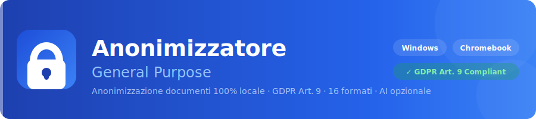
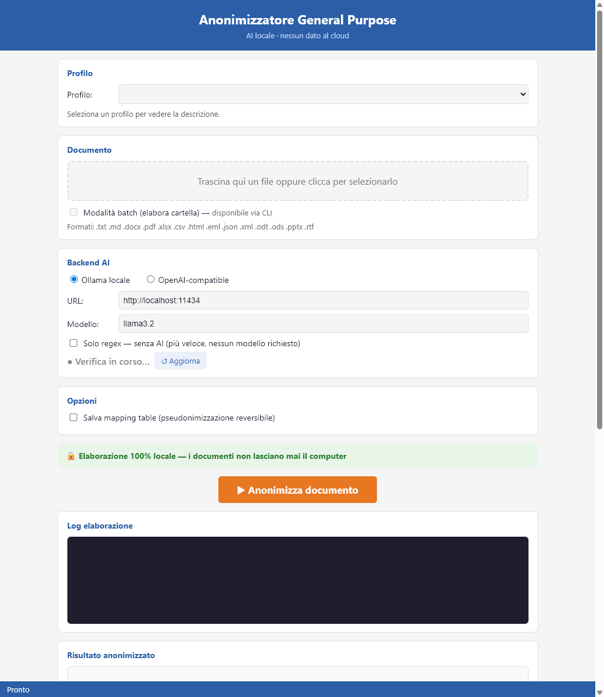

<p align="center">
  
</p>

<p align="center">
  <a href="https://giandemoncell-prog.github.io/anonimizzatore/">Sito web</a> ·
  <a href="https://github.com/giandemoncell-prog/anonimizzatore/releases/latest">Download</a> ·
  <a href="mailto:giandemoncell@gmail.com">Acquista Pro</a>
</p>

<p align="center">
  
  
  
  
  
</p>

---

Strumento professionale per anonimizzare documenti sensibili direttamente sul proprio computer.
Progettato per avvocati, medici, psicologi, insegnanti di sostegno, HR manager e ricercatori che trattano dati personali ai sensi del GDPR.

> **Perché locale?** I documenti che contengono dati sensibili ai sensi del GDPR Art. 9 (dati sanitari, DSA, diagnosi, fascicoli legali, dati del lavoro) non possono essere inviati a servizi cloud senza specifiche garanzie contrattuali. Questo strumento non trasmette nulla: elabora tutto sul tuo computer.

---

## Screenshot

### Web UI (browser-based)


### Interfaccia desktop (GUI tkinter)
La GUI desktop offre le stesse funzionalità in un'applicazione nativa Windows.

---

## Funzionalita

### Anonimizzazione in due fasi

**Fase 1 — Regex deterministiche** *(velocissima, sempre attiva)*
Rileva e sostituisce automaticamente dati strutturati:
codici fiscali, numeri di telefono, email, indirizzi, CAP, date, numeri di protocollo, IBAN, Partite IVA.

**Fase 2 — AI contestuale** *(tramite modello locale Ollama o API OpenAI-compatible)*
Individua e sostituisce nomi propri, strutture sanitarie, scuole, tribunali, aziende e qualsiasi entita identificativa che il regex non puo catturare automaticamente.

### Caratteristiche principali

- **GUI desktop** intuitiva + **Web UI** (browser, nessun plugin) + **CLI** per automazione e batch processing
- **Profili configurabili** per dominio (scolastico, medico, legale, HR, inglese)
- **Batch processing** su intere cartelle
- **Pseudonimizzazione reversibile** — salva una mapping table JSON per de-anonimizzare in seguito
- **Output preserva il formato** — un `.docx` anonimizzato rimane `.docx`
- **Backend AI configurabile** — Ollama locale, LM Studio, o qualsiasi API OpenAI-compatible
- **Zero dipendenze cloud** — funziona completamente offline (tranne download iniziale modello AI)

---

## Formati supportati

| Formato | Categoria | Output |
|---------|-----------|--------|
| `.docx` (Word) | Office | `.docx` — formato preservato |
| `.pdf` | Office | testo estratto → `.txt` |
| `.xlsx` (Excel) | Office | `.txt` |
| `.pptx` (PowerPoint) | Office | `.txt` |
| `.txt` / `.md` | Testo | stesso formato |
| `.csv` | Dati | `.txt` |
| `.json` | Dati | `.txt` |
| `.xml` | Dati | `.txt` |
| `.html` / `.htm` | Web | struttura HTML minimale |
| `.eml` (email standard) | Email | `.txt` |
| `.msg` (Outlook) | Email | `.txt` |
| `.odt` (LibreOffice Writer) | OpenDocument | `.txt` |
| `.ods` (LibreOffice Calc) | OpenDocument | `.txt` |
| `.rtf` (Rich Text) | Rich Text | `.txt` |

---

## Profili disponibili

| Profilo | Dominio | Entita gestite |
|---------|---------|----------------|
| `universal` | Qualsiasi documento, multilingua | Email, CF IT, IBAN, carte credito, telefoni, targa IT, CAP, date, indirizzi IT, IPv4/IPv6, MAC, SSN USA, NHS UK, GPS, protocollo |
| `italian_educational` | PDP, PEI, diagnosi funzionali | Alunno, genitori, docenti, specialisti, scuola, ASL |
| `italian_medical` | Cartelle cliniche, referti | Paziente, medici, strutture sanitarie |
| `italian_legal` | Contratti, atti, sentenze | Clienti, avvocati, tribunali, societa |
| `italian_hr` | Contratti lavoro, buste paga | Dipendente, azienda, IBAN |
| `english_generic` | Qualsiasi documento in inglese | Persone, organizzazioni, luoghi |
| `_template` | Profilo custom | Configura le tue entita |

I profili sono file `.yaml` editabili: puoi aggiungere nuovi domini senza modificare il codice.

---

## Come funziona

```
Documento originale
        |
        v
[Fase 1] Regex deterministiche
   → Codice fiscale → [CF]
   → Telefono       → [Telefono]
   → Email          → [Email]
   → Date           → [Mese/Anno]
   → ...
        |
        v
[Fase 2] AI contestuale (Ollama / OpenAI-compatible)
   → "Mario Rossi"       → [Nome dell'alunno]
   → "ASL Milano Nord"   → [Struttura sanitaria]
   → "Studio Bianchi"    → [Societa]
   → ...
        |
        v
Documento anonimizzato (.docx / .txt)
+ Mapping table JSON (opzionale, per de-anonimizzazione)
```

---

## Requisiti

**Sistema operativo:** Windows 10/11 (64-bit)

**Per la funzione AI (opzionale ma consigliata):**
- [Ollama](https://ollama.ai) — AI locale, gratuito
- Modello consigliato: `ollama pull llama3.2` (~2 GB)
- In alternativa: qualsiasi API OpenAI-compatible (LM Studio, Jan, ecc.)

> La modalita **Solo Regex** funziona senza AI e senza connessione internet.

---

## Download e installazione

**[Download bundle Windows (.zip)](https://github.com/giandemoncell-prog/anonimizzatore/releases/latest)**

1. Scarica e decomprimi il file `.zip`
2. Avvia `Anonimizzatore.exe` dalla cartella estratta
3. Installa [Ollama](https://ollama.ai) se vuoi usare la funzione AI (opzionale)

**Dimensione bundle:** ~37 MB — nessuna dipendenza aggiuntiva richiesta.

### Chromebook / Linux

```bash
# Scarica il pacchetto Chromebook dalla pagina Releases, poi:
bash install.sh
```

### Web UI (qualsiasi browser)

```bash
# Avvia l'interfaccia web locale su http://localhost:5000
.\start_web.ps1   # Windows
bash start_chromebook.sh  # Linux / Chromebook
```

---

## Prezzi

| Piano | Prezzo | Per chi |
|-------|--------|---------|
| **Free** | Gratuito | 5 documenti/mese, .txt e .docx, profilo generico |
| **Pro** | €129/anno | Tutti i formati, tutti i profili, batch, pseudonimizzazione |
| **Pro Perpetua** | €229 una tantum | Come Pro, aggiornamenti inclusi per 12 mesi |
| **Studio** | €399/anno | Multi-postazione (fino a 5), CLI avanzata, audit trail |

**[Acquista una licenza](mailto:giandemoncell@gmail.com?subject=Licenza%20Anonimizzatore)** — scrivi per ricevere il link di acquisto sicuro con fattura IVA italiana.

Hai domande sul piano giusto per te? Scrivi a: **giandemoncell@gmail.com**

---

## Installazione a domicilio

Non hai tempo per l'installazione? Offriamo un servizio di installazione e formazione a domicilio o in studio.

- **Installazione base** (1,5 ore): €150
- **Pacchetto completo** (installazione + configurazione profilo + formazione): €230
- **Supporto remoto** (via TeamViewer): €70

[Richiedi un appuntamento](mailto:giandemoncell@gmail.com?subject=Installazione%20a%20domicilio)

---

## Roadmap

- [x] GUI desktop + CLI
- [x] Profili YAML configurabili
- [x] Backend multipli (Ollama, OpenAI-compatible)
- [x] Pseudonimizzazione reversibile
- [x] Batch processing
- [x] Profilo Universal multilingua (16 regex globali)
- [x] Modalità Solo Regex (senza AI, offline completo)
- [x] Web UI (Flask, funziona su Chromebook e qualsiasi browser)
- [x] Pacchetto Chromebook / Linux
- [ ] macOS support
- [ ] Profilo multilingua automatico (auto-detect lingua)
- [ ] Editor profili integrato nella GUI
- [ ] Plugin per Microsoft Word

---

## Domande frequenti

**Il mio documento viene inviato a qualche server?**
No. L'elaborazione avviene interamente sul tuo computer. Se usi Ollama, il modello AI gira in locale. Se scegli un'API esterna (OpenAI, ecc.), il documento viene inviato a quel servizio — ma la scelta e sempre tua.

**Funziona senza Ollama?**
Si. La modalita "Solo Regex" anonimizza dati strutturati (CF, telefoni, email, date, ecc.) senza nessun modello AI. Per i nomi propri e le entita semantiche e necessario un modello AI.

**Posso creare profili per il mio settore specifico?**
Si. I profili sono file `.yaml` editabili nella cartella `profiles/` accanto all'installazione. Il file `_template.yaml` spiega ogni campo con esempi.

**E disponibile per macOS o Linux?**
Al momento solo Windows. macOS e in roadmap.

---

## Segnalazioni e supporto

- **Bug o problemi:** apri una [Issue](https://github.com/giandemoncell-prog/anonimizzatore/issues)
- **Domande commerciali:** giandemoncell@gmail.com

---

*Sviluppato in Italia — Conforme GDPR Regolamento UE 2016/679*
